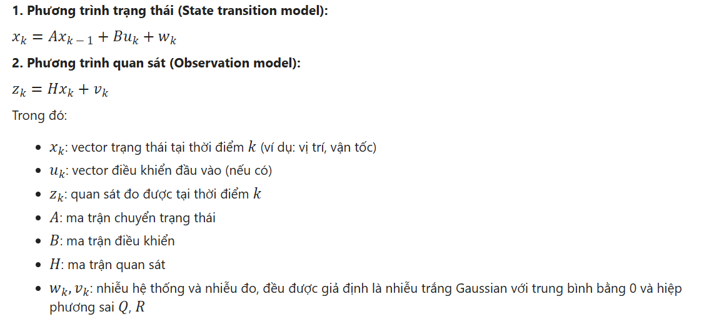
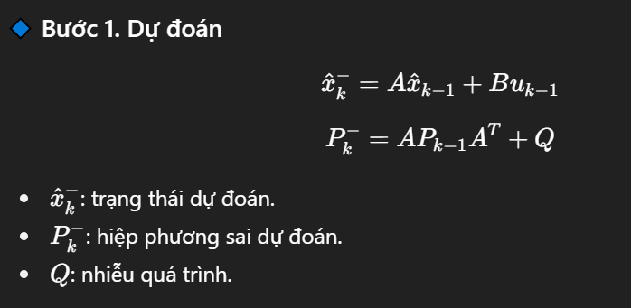
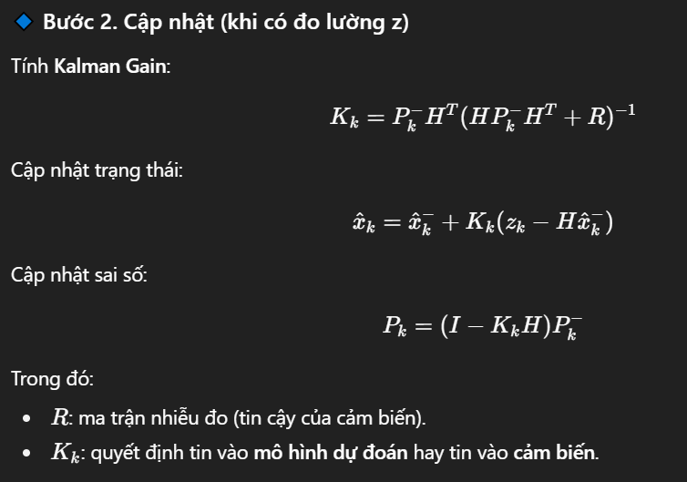

# HIỂU VỀ BỘ LỌC KALMAN # 
## 1. GIỚI THIỆU CHUNG ##
- Bộ lọc Kalman (Kalman filter) là một thuật toán ước lượng trạng thái động được sử dụng rộng rãi trong các hệ thống kỹ thuật và khoa học. 
- Nó cho phép dự đoán trạng thái hiện tại và tương lai của một hệ thống từ các quan sát bị nhiễu, đồng thời liên tục cập nhật các ước lượng này khi có dữ liệu mới.
- Nó kết hợp các thông tin từ nhiều nguồn đo (có nhiễu) để ước lượng tốt nhất trạng thái của hệ thống.
- Bộ lọc này đặc biệt hiệu quả trong các hệ thống có biến động theo thời gian và có yếu tố ngẫu nhiên, chẳng hạn như cảm biến gia tốc trục, vệ tinh, máy báy, drone,...
- Khác với low-pass filter hay complementary filter, Kalman không chỉ lọc nhiễu mà còn dự đoán trạng thái tiếp theo của hệ thống dựa trên mô hình toán học của hệ thống

Ví dụ trong xe cân bằng sử dụng cảm biến gia tốc & con quay hồi chuyển: 
 * Gia tốc kế (accelerometer) cho ta góc nghiêng chậm nhưng ổn định (ít trôi)
 * Con quay hồi chuyên (gyroscope) cho ta tốc độ góc nhanh nhưng bị trôi (bias/drift) dần theo thời 
 * Kalman filter sẽ trộn cả 2 để có được góc nghiêng mượt, ít trễ, không trôi

## 2. CÁC MÔ HÌNH TOÁN HỌC HỆ THỐNG ##
- Bộ lọc Kalman hoạt động dựa trên mô hình hệ thống tuyến tính rời rạc và sử dụng lý thuyết xác suất để kết hợp thông tin từ mô hình dự đoán và dữ liệu quan sát. Mục tiêu chính là giảm thiểu sai số trung bình bình phương của ước lượng trạng thái
- Kalman Filter làm việc dựa trên 2 mô hình chính: 

## 3. NGUYÊN LÝ HOẠT ĐỘNG ## 
- Bộ lọc Kalman thực hiện 2 giai đoạn chính một cách lặp đi lặp lại: 
  * Giai đoạn Dự Đoán (Predict): Dựa trên trạng thái ước tính ở thời điểm trước và mô hình động học (ma trận A) của hệ thống, bộ lọc sẽ dự đoán trạng thái tiếp theo và độ không chắc chắn (hiệp phương sai) của dự đoán đó.
    - Trong giai đoạn Predict, dùng tốc độ góc của `Gyro` để tiên đoán trạng thái tiếp theo. Vì muốn tính góc thì phải tích phân tốc độ góc theo thời gian.
  
  * Giai đoạn Cập Nhật (Update): Khi có một phép đo mới từ cảm biến, bộ lọc sẽ kết hợp thông tin dự đoán với phép đo này để tạo ra 1 ước tính trạng thái cuối cùng. Độ lợi của bộ lọc (Kalman Gain) sẽ quyết định mức độ ảnh hưởng của phép đo mới đến ước tính cập nhật, dựa trên sự không chắc chắn của cả dự đoán và phép đo.
  
    - Trong giai đoạn Update, dùng đo đạc từ `Accel` để tinh chỉnh, loại bỏ drift. Ta lấy giá trị này kết hợp với giá trị dự đoán từ `Gyro` để tạo ra ước tính trạng thái cuối cùng.